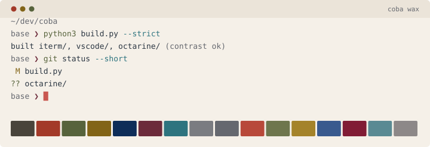
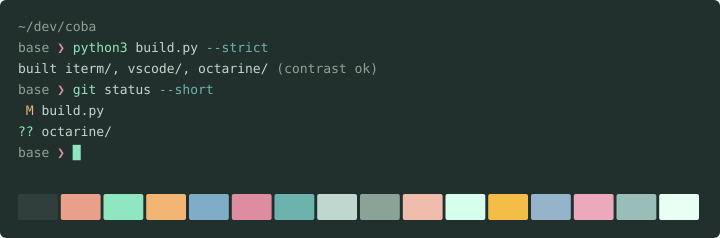
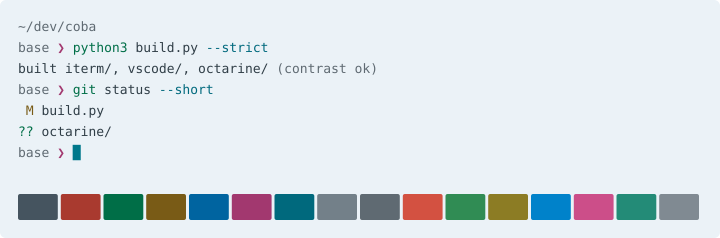
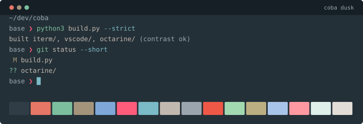

# coba

Four terminal and editor themes, inspired by Le Corbusier's *Polychromie
Architecturale* and taken somewhere of my own.

Two pairs, each a light scheme and a dark one that follow the macOS appearance
switch together. **coba wax** and **coba pine** are the warm pair, a blush
ground and a deep green. **coba dawn** and **coba dusk** are the cool pair, on
a slate axis.

**The warm pair**





**The cool pair**






<sup>Unité d'Habitation, Marseille. Photo © Laurian Ghinitoiu, via
[ArchDaily](https://www.archdaily.com/1003880/le-corbusiers-color-theory-embracing-polychromy-in-architecture).</sup>

## Install

```sh
brew install --cask font-ibm-plex-mono
brew install zsh-autosuggestions zsh-syntax-highlighting
./install.sh
```

Close iTerm2 first: it rewrites its plist on exit and would undo the margins.

Installs two dynamic profiles, each following the macOS light/dark switch on
its own. `coba` is the warm pair, wax by day and pine by night; `coba cool` is
dawn and dusk. Both inherit everything else from your `Default` profile.

**VS Code**

```sh
ln -s "$PWD/vscode" ~/.vscode/extensions/cyra.coba-1.1.0
```

The directory name must match `publisher.name-version` from
`vscode/package.json`. Bump both together when reinstalling: VS Code records
uninstalled folder names in `.obsolete` and never loads that name again.

Restart VS Code, then Cmd+K Cmd+T and pick **coba wax**, **coba pine**,
**coba dawn** or **coba dusk**. Cursor uses `~/.cursor/extensions/` instead.

**Octarine**

```sh
./install-octarine.py
```

Quit Octarine first: it rewrites `themes.json` from memory and would drop the
merge. Merges all four into `<workspace>/.octarine/themes.json`. Existing
themes are kept, and one matching a coba name is refreshed in place rather than
duplicated, so the active-theme setting still resolves.

The `octarine/*.css` files are the same palettes as variable blocks, for
Settings > Theme Creator > Paste from Clipboard.

Octarine themes are colour only: fonts are workspace settings, and code blocks
are pinned to shiki's own themes.

**zsh**

```sh
echo '[[ ! -r "$PWD/zsh/coba.zsh" ]] || source "$PWD/zsh/coba.zsh"' >> ~/.zshrc
```

Must be the last thing `.zshrc` sources: zsh-syntax-highlighting wraps the ZLE
widgets and anything loaded after it goes unhighlighted. The styles use ANSI
indices rather than hex, so the highlighting follows the light/dark switch too.

It also repoints [Pure](https://github.com/sindresorhus/pure), if you use it.
Pure hardcodes five slots to xterm-256 indices that no terminal palette can
reach, and two of them land badly: 242 is 2.6:1 on pine, its dirty marker 1.5:1
on wax. Loading after `prompt pure` is fine, Pure re-reads zstyles each prompt.

## Notes

**Padding** is app-wide in iTerm, not per-profile, so `install.sh` writes
`SideMargins` and `TopBottomMargins` directly. Change the numbers there and
re-run it.

**Fonts** are stored by PostScript name, so the profile says `IBMPlexMono 12`.
`IBM Plex Mono 12` fails silently and falls back to Monaco.

**Contrast** is checked before anything is written: foreground, comments and
ANSI 1-6 at 4.5:1 against the ground, everything else at 3:1, and slots that
mean different things held apart in dE so none of them read as one colour.
`ansi0` is exempt, as the shadow slot. `build.py --strict` exits non-zero if
anything slips, and CI runs it on every push.

Every measured figure is in [CONTRAST.md](CONTRAST.md), regenerated with the
themes so it cannot drift from what is enforced.

## Rebuilding

`build.py` holds all four palettes and generates everything else. Edit the
`WAX`, `PINE`, `DAWN` or `DUSK` dicts, then:

```sh
python3 build.py
```

Writes `iterm/`, `vscode/themes/`, `octarine/`, `assets/`, `palette.json` and
`CONTRAST.md`. No dependencies. `python3 test_build.py` checks the colour maths
that the gate relies on.

## Credits

Le Corbusier's colours are administered by
[Les Couleurs Suisse AG](https://www.lescouleurs.ch/the-colour-system); hex
values from [this gist](https://gist.github.com/oelna/743be12076895e2c2d662c631f34ec97).

MIT, see [LICENSE](LICENSE).
